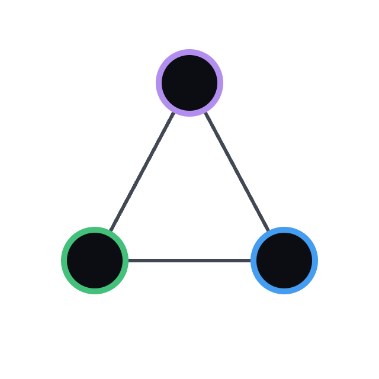
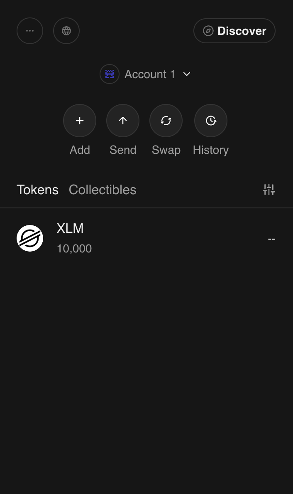
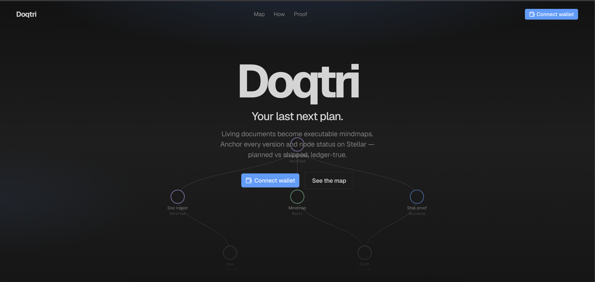
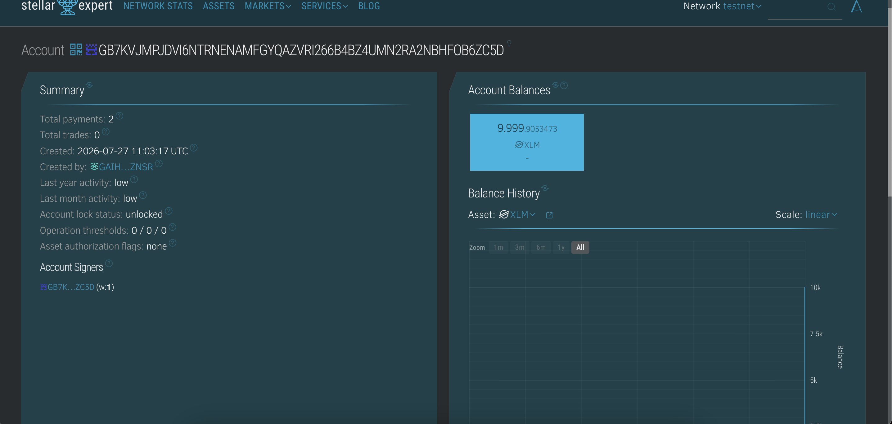
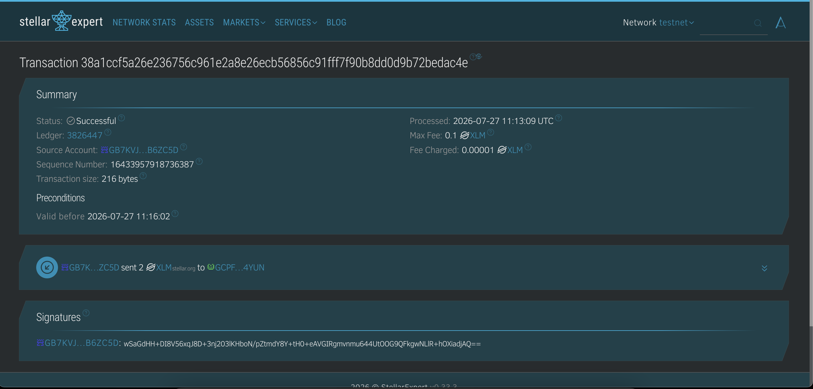

<p align="center">
  
</p>

<h1 align="center">Doqtri</h1>

<p align="center">
  <strong>Living documents → executable mindmaps → on-chain proof</strong>
</p>

<p align="center">
  Compile plans into mindmaps, track Planned → Verified build status, and anchor
  every version hash on <a href="https://stellar.org">Stellar</a> so “planned vs shipped” is ledger-true.
</p>

<p align="center">
  <a href="https://drive.google.com/file/d/1Fr_7cFn6m7hc4HesTbZ2Wlbp2i3bljXk/view?usp=sharing"></a>
  <a href="https://docs.google.com/presentation/d/14KDwpFrQ6QjlT4QC-vzjSss-0-tO6tocOBNSyBOhi8w/edit?usp=sharing"></a>
  <a href="https://docs.google.com/spreadsheets/d/1szS0QGWCdsUu69XcxKGW3xFChVB3fri059fGxfEzCsA/edit?usp=sharing"></a>
</p>

<p align="center">
  <a href="https://lab.stellar.org/r/mainnet/contract/CCP5KFIWLUNPV2G7ATBKFMIZF54JYRC343P5JCTARC4PRTGM23IU6ET4"></a>
  <a href="https://lab.stellar.org/r/testnet/contract/CCB5DFZRFFDCIBV5H5KWO6UCVN4ZXIPUSXONMBA6HVF433SPO7YEWMSB"></a>
  <a href="#license"></a>
</p>

<p align="center">
  <a href="https://drive.google.com/file/d/1Fr_7cFn6m7hc4HesTbZ2Wlbp2i3bljXk/view?usp=sharing">Demo video</a> ·
  <a href="https://docs.google.com/presentation/d/14KDwpFrQ6QjlT4QC-vzjSss-0-tO6tocOBNSyBOhi8w/edit?usp=sharing">Pitch deck</a> ·
  <a href="https://docs.google.com/spreadsheets/d/1szS0QGWCdsUu69XcxKGW3xFChVB3fri059fGxfEzCsA/edit?usp=sharing">Onboarding survey responses</a> ·
  <a href="https://stellar.expert/explorer/public/contract/CCP5KFIWLUNPV2G7ATBKFMIZF54JYRC343P5JCTARC4PRTGM23IU6ET4">Mainnet contract on Stellar Expert</a> ·
  <a href="https://stellar.expert/explorer/testnet/contract/CCB5DFZRFFDCIBV5H5KWO6UCVN4ZXIPUSXONMBA6HVF433SPO7YEWMSB">Testnet contract on Stellar Expert</a>
</p>

<p align="center">
  
  
  
  
  
  
</p>

---

## Problem

Teams plan in living documents — Google Docs, Notion, markdown vaults — then
ship work in n8n, Make, Retool, Langflow, and scattered repos.

That creates a trust gap:

- **Plans and reality diverge.** The doc says “done”; the workflow was never built.
- **Progress is unverifiable.** “Shipped” badges live in private app state anyone can edit.
- **No shared receipt.** Stakeholders can’t independently check what version of the plan
  was active, or which mindmap nodes actually went live.
- **Audit trails rot.** Screenshots and status meetings don’t survive handoffs, vendor
  churn, or “we’ll update the doc later.”

In short: **you can’t cryptographically prove planned vs shipped.**

## Solution

**Doqtri** is Obsidian for executable plans — with Stellar as the proof layer.

| Layer | What it does |
| --- | --- |
| **Vault + editor** | Write the living plan in markdown; `##` headings compile into a mindmap |
| **Executable mindmap** | Each node tracks lifecycle: Planned → Building → Built → Verified |
| **Ship panel** | Attach the builder (n8n / Make / Retool / Langflow) and artifact ref |
| **DoqtriRegistry (Soroban)** | Anchor SHA-256 doc hashes + node status on Stellar with owner auth |
| **Public audit** | Anyone opens `/d/[docId]` and reads the ledger — not your database |

**Result:** every semantic change bumps an on-chain version; every shipped node
leaves a receipt. Planned vs shipped stops being a slide and becomes a fact.

## Vision

Most roadmaps live in docs. Most “shipped” badges live in app state. Those two
worlds drift apart.

**Doqtri** closes the gap:

1. Watch a living source (Docs, Notion, markdown).
2. Compile it into a typed, executable mindmap.
3. When a node is scaffolded into n8n / Make / Retool / Langflow, record build status.
4. Anchor document content hashes and node lifecycle on Stellar Soroban so
   anyone can verify progress from the ledger — not a private database.

> Planned vs shipped becomes a receipt, not a marketing claim.

---

## Demo, deck and data

| Asset | Link |
| --- | --- |
| **Demo video** — 1920×1080, ~117s walkthrough, no audio | [Watch on Google Drive](https://drive.google.com/file/d/1Fr_7cFn6m7hc4HesTbZ2Wlbp2i3bljXk/view?usp=sharing) |
| **Pitch deck** — 14 slides, problem → traction → ask | [Open in Google Slides](https://docs.google.com/presentation/d/14KDwpFrQ6QjlT4QC-vzjSss-0-tO6tocOBNSyBOhi8w/edit?usp=sharing) |
| **Onboarding survey** — 50 responses, wallet · email · name · rating · feedback | [Open in Google Sheets](https://docs.google.com/spreadsheets/d/1szS0QGWCdsUu69XcxKGW3xFChVB3fri059fGxfEzCsA/edit?usp=sharing) |
| **Mainnet feedback** — 20 users | [Open in Google Sheets](https://docs.google.com/spreadsheets/d/1GUu0xxzByakSS_zG9otQRCnXqnVlt-cW_ytqngsmk5c/edit?usp=sharing) |
---

## Features

### On-chain registry (`contract/`)

- **Document versions** — SHA-256 content hash per `doc_id`, version increments on every semantic update
- **Node build status** — `Planned → Building → Built → Verified` with tool name + artifact ref
- **Owner auth** — every write requires `require_auth()` on the document owner
- **Persistent storage + TTL** — 30-day threshold, extend to 90 days on write
- **Events** — `(doqtri, register|update|node)` with **`doc_id` payload**

### App (`doqtri/frontend` + `doqtri/backend`)

- Obsidian-style **vault**: markdown notes, wikilinks, global graph + per-doc mindmap
- Supabase Auth (email/password) + RLS on `documents`
- **Ingest** / **regenerate** via OpenAI (`/api/ingest`, `/api/regenerate`)
- Private Storage bucket for uploads (`doqtri/backend/migrations/`)
- Deploy target: Vercel Root Directory = `doqtri/frontend`

### Legacy / chain (`web/`, `contract/`)

- `web/` — previous Freighter + Soroban UI (kept for reference, not primary)
- `contract/` — DoqtriRegistry, deployed on Stellar mainnet and testnet (built in CI)

---

## Deployed contracts

The app runs against **mainnet**. Testnet stays live as the free sandbox and is
where the 50-user product test below was run.

### Stellar Mainnet — live

| Field | Value |
| --- | --- |
| **Network** | Stellar Public Network (mainnet) |
| **Contract ID** | [`CCP5KFIWLUNPV2G7ATBKFMIZF54JYRC343P5JCTARC4PRTGM23IU6ET4`](https://lab.stellar.org/r/mainnet/contract/CCP5KFIWLUNPV2G7ATBKFMIZF54JYRC343P5JCTARC4PRTGM23IU6ET4) |
| **WASM hash** | `6abac53e2306b09a13f6eb60649953305159ba293f8f97a2ab0720c6a26ad9af` |
| **Deployed** | 2026-07-30 |

**Explorer links**

- [Open in Stellar Lab](https://lab.stellar.org/r/mainnet/contract/CCP5KFIWLUNPV2G7ATBKFMIZF54JYRC343P5JCTARC4PRTGM23IU6ET4)
- [Contract on Stellar Expert](https://stellar.expert/explorer/public/contract/CCP5KFIWLUNPV2G7ATBKFMIZF54JYRC343P5JCTARC4PRTGM23IU6ET4)
- [WASM upload transaction](https://stellar.expert/explorer/public/tx/8977c7b74768fce80768116cfe3d7a4270519471b5d34ff113302c348de9b336)
- [Deploy transaction](https://stellar.expert/explorer/public/tx/9035158124d14a202347a990d9c3d1e63a844c35e64e2f46f3e3572ac801fbd2)

**What mainnet actually costs**

| Operation | Fee charged |
| --- | --- |
| WASM upload (one-time) | 8.0525 XLM |
| Deploy contract (one-time) | 0.0183 XLM |
| `register_document` | 0.055094 XLM |
| `set_node_status` | 0.048082 XLM |
| `update_document` | 0.000801 XLM |
| Full document lifecycle, per user | ~0.104 XLM |

The upload is expensive because the code entry's rent dominates it — about 17×
the testnet price, while a `register_document` write costs only ~1.5× testnet.
That rent expires: keep the code entry alive with
`stellar contract extend --wasm-hash <hash> --network mainnet --ledgers-to-extend <n>`.

### Mainnet — 20 wallets · 60 transactions

| # | Name | Wallet | Doc ID | Register | Update | Node sync |
| --- | --- | --- | --- | --- | --- | --- |
| 1 | Jomar Tolentino | [View wallet](https://stellar.expert/explorer/public/account/GAMZMS5SSPRUNKAQ3BPLK3NITIX7TZPNJSEMNO6YKLASAKLL7SEFEIG4) | `jomar-tolentino-plan` | [Register](https://stellar.expert/explorer/public/tx/cf8930e11899f47891061afd8525db703cc6fb0588b29c4aaa8b7e3c764e9c3b) | [Update](https://stellar.expert/explorer/public/tx/c3b6e6bfb379335a36ab9bee0f82c2cf5ddd18211aacb3a82145a6d183203d1d) | [Node sync](https://stellar.expert/explorer/public/tx/5ce3cfe496a75bad10355823c62cd850acaa2c62d7d1d788e29cfccfe17534ae) |
| 2 | Trisha Mangubat | [View wallet](https://stellar.expert/explorer/public/account/GAL6WE6RLBKBDZBA6EE2IL5NVW3K46CFWO55S25ZMOAAHVIJYDRZCBLG) | `trisha-mangubat-plan` | [Register](https://stellar.expert/explorer/public/tx/e2f24f7409e8f8eff4c0ea828cf658962d75b007ee79ba03b71632c568bafd00) | [Update](https://stellar.expert/explorer/public/tx/955493be56f0252e21d67d09476b94a8a3c0c9fafae61f041e427c865876f53b) | [Node sync](https://stellar.expert/explorer/public/tx/f042bbda8a9f252bba1a0b5d0193d145ade403e183099f4e1a1152d79aadca99) |
| 3 | Noel Katigbak | [View wallet](https://stellar.expert/explorer/public/account/GCVGJLWT7RX5YAP6YWVQO2G57NWGCVOYNHZFLCARMYGZ6AQVNHLGSJ4I) | `noel-katigbak-plan` | [Register](https://stellar.expert/explorer/public/tx/74515479fd9f3745de79fbf244c3c8f1017a9d07694096d7724fec36ab7f918c) | [Update](https://stellar.expert/explorer/public/tx/4830ce48912fb2c3115ac9a1a9daf66d2a08e739548d348df9536df8ce638744) | [Node sync](https://stellar.expert/explorer/public/tx/5f9c7034d89f96dd38161de794b58a3b97c1c44fff1495f9f588fb301fa3d746) |
| 4 | Marilou Sandoval | [View wallet](https://stellar.expert/explorer/public/account/GDMH7NZKM45VGMAZU7TGROUOXQTZ2ODWRHRBNVC34X7FBSDR4CBLESX6) | `marilou-sandoval-plan` | [Register](https://stellar.expert/explorer/public/tx/aeb421cb976169340c1f5748efc64889298b0e804ab9d7047179402c7d3bb370) | [Update](https://stellar.expert/explorer/public/tx/d591c8fbee0b2c87b65a2d3251c6e861bb5195c56d1247aa0bd6ee8cc88ad9cc) | [Node sync](https://stellar.expert/explorer/public/tx/be159657af8caa2859d51f66b15681c330bf5fc997598f34ddf78971ac44598c) |
| 5 | Ferdinand Cayetano | [View wallet](https://stellar.expert/explorer/public/account/GARFVAP4RRURZC6DQBR5VYKOOBPAZQQOIOWJIDOQQSTCHIYBEC5I76IB) | `ferdinand-cayetano-plan` | [Register](https://stellar.expert/explorer/public/tx/f5aff31fbb92e3649790289a470c5073edde43fac2244336363713b620d46335) | [Update](https://stellar.expert/explorer/public/tx/a3d977c5523c5d9d8e2e3a42fea5679951a16841344f2862e121178ddee81275) | [Node sync](https://stellar.expert/explorer/public/tx/3279f138ee49856bc8de73ed777db290a2d1ddedfac9984567770490a931700a) |
| 6 | Rowena Alcantara | [View wallet](https://stellar.expert/explorer/public/account/GAFDVYSSPCOKKRZUXKA5RS6ILAO67NRNCN7HFK4OOUZJ6MUWAABBCB3Q) | `rowena-alcantara-plan` | [Register](https://stellar.expert/explorer/public/tx/411c2fde2406393937a52127a65929d7d1e97db8178f26288ada57722ec8bff5) | [Update](https://stellar.expert/explorer/public/tx/e032ac525d0ee47318273155ce549b9cdd35e24ac7b615bf6d82bedba062753b) | [Node sync](https://stellar.expert/explorer/public/tx/3cf17f16d59f024c48591a447c1a632e8b3e69e0c2d417473f491f884d439784) |
| 7 | Dante Bermudez | [View wallet](https://stellar.expert/explorer/public/account/GBU6SESO4CCGICNVQ2O37WFXVRVCSNYNC3QWSML53PDWDXEOUJMIEAGL) | `dante-bermudez-plan` | [Register](https://stellar.expert/explorer/public/tx/70232c56fa8f5dab0d6cfe996079eed2c63a19c9c3ad4487c70977430f04a02d) | [Update](https://stellar.expert/explorer/public/tx/e889064640b57405c282a6588f643f8787635bada4b95742c788e18ce17f5c67) | [Node sync](https://stellar.expert/explorer/public/tx/402fbc02ddc5156344a2a1c3d933f24afd2a2f110db9a5a39fefb8776a4906a2) |
| 8 | Marivic Concepcion | [View wallet](https://stellar.expert/explorer/public/account/GDCYJQHCWLGUUGCXJZ4GJ3YNO2W66FIJNFPFUOEZF3QCJRY53ABDKSDT) | `marivic-concepcion-plan` | [Register](https://stellar.expert/explorer/public/tx/013c6705133d928c0031ffb06980cc13d59422e0f2274b03cfdb4f7c3548a000) | [Update](https://stellar.expert/explorer/public/tx/b058edb2f54347301d8ac59873441c924edb184cdd095f0416ae7aa10eba479d) | [Node sync](https://stellar.expert/explorer/public/tx/45c6d922bf858f13f7df86316097f036699a9bb3716b5b944965c790bf9b53b9) |
| 9 | Erwin Dimaculangan | [View wallet](https://stellar.expert/explorer/public/account/GDIOPOCURCOXH7TTUCS2JKBWGPZKR5SMTKMCBOQZK4NRXAEJUMR66HZD) | `erwin-dimaculangan-plan` | [Register](https://stellar.expert/explorer/public/tx/ae429ca135e31b08f46721469db6cbe290c71d77fb4bb35cab16e10d2a473da3) | [Update](https://stellar.expert/explorer/public/tx/2778da438799e2d624ffdd79f13ae57ad6c2e1dca0fbf0d6790ca8086a5daea3) | [Node sync](https://stellar.expert/explorer/public/tx/3a7324fbf24b1917583c6316dad38dbd02b7253e77e666d6d5484348b5ee1a8a) |
| 10 | Cherry Escudero | [View wallet](https://stellar.expert/explorer/public/account/GA5NBQ2QCDPAPHEFE6STQ6O7RRT22IDJNYYVGCLL36RN66TCCKMKGSUF) | `cherry-escudero-plan` | [Register](https://stellar.expert/explorer/public/tx/944fcb13aec2d6183b8a34754252ea398caba70f5e5b422328b84f3df1fa1dab) | [Update](https://stellar.expert/explorer/public/tx/a7bfdf44c4c7f7b58782eda93e0fae455911edaa64ba484e53c5399aac2172ce) | [Node sync](https://stellar.expert/explorer/public/tx/43d27d835c4c8f539c018f69e23e59799cc14533907c1039255eba8c5e26bf70) |
| 11 | Aldrin Fajardo | [View wallet](https://stellar.expert/explorer/public/account/GCPXFBX3CLCUD5IKYYT65HL6AO26V6DSDLDO4TOHUI4FEVI5BTI5BCAK) | `aldrin-fajardo-plan` | [Register](https://stellar.expert/explorer/public/tx/52a30f1da1e6d22b934527f9fe4e12978b954b9aaba3a0502288d4e7e6b9d65d) | [Update](https://stellar.expert/explorer/public/tx/103b93569b10881dc160d30202ed398b1afdb21a979c3e2dcecd6ba3309e03cb) | [Node sync](https://stellar.expert/explorer/public/tx/446d8876066524e681c378129ecbdd61413a7d483700b3c78c56f0f102a22d45) |
| 12 | Girlie Gatchalian | [View wallet](https://stellar.expert/explorer/public/account/GAGP3ULNSVT5WYOHWW33RVLB43VF7DMOJW6KZOPJI7RXD3LJQG7USI3V) | `girlie-gatchalian-plan` | [Register](https://stellar.expert/explorer/public/tx/b36819f85d4173cfe1985ac8426d05b35c83b1eafa95d59d34d4705001126b48) | [Update](https://stellar.expert/explorer/public/tx/84d77b0b45e3fb600f9c2d5b2338c4a9d414f985efae9801f0d3d4f2227f1a4e) | [Node sync](https://stellar.expert/explorer/public/tx/e71a6070029e7762301370de7867324d48230ad1458a3d1c77cc3f966b26822c) |
| 13 | Nestor Hizon | [View wallet](https://stellar.expert/explorer/public/account/GA4UELQHQQFXKEW5QCTTVHAA3ZLQJXK5GZZ26HXFRZPV3GRMIBIH6VN6) | `nestor-hizon-plan` | [Register](https://stellar.expert/explorer/public/tx/fe8d1349c720612639791259270806c7624d01267b27e79e4ded61ae3ba12893) | [Update](https://stellar.expert/explorer/public/tx/8839ffb70bdb7ba813aa89e87f103f105e9846871f5b37673dd3c14642d3c77f) | [Node sync](https://stellar.expert/explorer/public/tx/b67bd4854eac01ed59ef9df2d4b78d7f7f2be62a00cab99aac9527fa9e7c2275) |
| 14 | Jocelyn Ilagan | [View wallet](https://stellar.expert/explorer/public/account/GBUCNZGDNVX4ECPLCLWL26EDFAJGKCBDJJE5LC7M5SUSNSPWKOJEXFPU) | `jocelyn-ilagan-plan` | [Register](https://stellar.expert/explorer/public/tx/81149d333e94dddc29a2d609f2dbde245d59608392ec812bd5825ef17d51c886) | [Update](https://stellar.expert/explorer/public/tx/930c5f44b56e222ee7086621da3a7d5427f0259ab8b3b9e06ee2c4ff4f1414a3) | [Node sync](https://stellar.expert/explorer/public/tx/e5b36369f4e669f52675fbee51cab7b034d15b13cb286237f231d17175987c8a) |
| 15 | Rodel Jimenez | [View wallet](https://stellar.expert/explorer/public/account/GDADK2KO6ABCX6QOMCZFBL7PGTP22EWJRD3C3FS76XRGXC76WEAN57R3) | `rodel-jimenez-plan` | [Register](https://stellar.expert/explorer/public/tx/4f222c4ac09b4fa053f4a557e23ec1a2085c4e525447044bba7539d705c61dc9) | [Update](https://stellar.expert/explorer/public/tx/90ad121d3775ac166bc7431069875409c2433e4b6c2ae96442b6e957a60d6413) | [Node sync](https://stellar.expert/explorer/public/tx/4966213f3f99014b6ee71b73ce92708d3e54bb6f4031b96b9f316272e656ccd6) |
| 16 | Precious Lumbao | [View wallet](https://stellar.expert/explorer/public/account/GCPODNJU5TR2VVR4RHH5HTNFSO3KB4JZSYED3KTZQH5ADNOODYMU54KX) | `precious-lumbao-plan` | [Register](https://stellar.expert/explorer/public/tx/3abd5182d1e029f2d6c1c3f734a4420f709b052699558b771531805a905f2831) | [Update](https://stellar.expert/explorer/public/tx/07f989eefcac1437aeaeb9136a67005349dfe9b093c1d3c5ccdfc8b843d45a0c) | [Node sync](https://stellar.expert/explorer/public/tx/0b1af1fb37133e60d5c65b3896d921ea3be9d598ce669de854dc2cd153ba37aa) |
| 17 | Bernard Marasigan | [View wallet](https://stellar.expert/explorer/public/account/GCTGKVPUABCZZKTX4S3ENHUFE5T4I7LN5DLWEXYHDN3G2YL5QIWJNX53) | `bernard-marasigan-plan` | [Register](https://stellar.expert/explorer/public/tx/ae985a82202cfa8299b2271ed0742ec2c7428d546a4f6d89fcacda055e7636c4) | [Update](https://stellar.expert/explorer/public/tx/09b020f36aff4a4af5502b65749000f339da9026462bd8ace9ca2c194d1b0051) | [Node sync](https://stellar.expert/explorer/public/tx/c9dd22a4ab63d836993cfeda3e5932c021620293d4c28e3c8a3f90f09f7422e9) |
| 18 | Katrina Nazareno | [View wallet](https://stellar.expert/explorer/public/account/GBHFKBIHK5535CTAUCCFYBOE775QMB62GJ6EAJEURR6IH6WTBLJG67SY) | `katrina-nazareno-plan` | [Register](https://stellar.expert/explorer/public/tx/1c70aa838df32a807dfb6d6f77180e865316893e5959de5071821b1670b4b2e8) | [Update](https://stellar.expert/explorer/public/tx/5e8c02b0fbe7edc7f28594d7017b683263b99f2bce73b3b722e32e2404065192) | [Node sync](https://stellar.expert/explorer/public/tx/c9c05d8514969e22e4abb82ce40960d7a88241eee95b9f713f9e00cbd9fb5ce6) |
| 19 | Onofre Obispo | [View wallet](https://stellar.expert/explorer/public/account/GCBH4X7DNWERPLAQ5LBMYABFADTPHMQS6LR22BOO4YK2FTVFQVHA4U5D) | `onofre-obispo-plan` | [Register](https://stellar.expert/explorer/public/tx/e4229460aaad0f3081d3e1bc3e80f1dad13400627eb4e17ac184ab6f3a19261a) | [Update](https://stellar.expert/explorer/public/tx/b6c24cff8c6af7a6cfb6dcd2966f1925148b4496e6fe2656d18ae6641f339808) | [Node sync](https://stellar.expert/explorer/public/tx/82a8c435f63ad26a13896b66379d4851a557a40deb02f497985695c90bbe926e) |
| 20 | Rhea Pangilinan | [View wallet](https://stellar.expert/explorer/public/account/GDA7V2WOOJ56NX7F6KB4CS7OMGDO2MS33JZI5LB3GUB76TQHFNEX5QZM) | `rhea-pangilinan-plan` | [Register](https://stellar.expert/explorer/public/tx/f300750d17fe949be80e57a412eddfadfcf896381c69d2bae9462c8d09e4c76f) | [Update](https://stellar.expert/explorer/public/tx/3ed0ddddb566fc7f1a896b6b31ffa2e73a335b3fdfb7eda97d8af1a2c4c9fab5) | [Node sync](https://stellar.expert/explorer/public/tx/ca73befe121811f06f5c39311758d3527b83e861fd3bc4fe3fde0b3df0da4813) |

### Stellar Testnet — sandbox

| Field | Value |
| --- | --- |
| **Network** | Stellar Testnet |
| **Contract ID** | [`CCB5DFZRFFDCIBV5H5KWO6UCVN4ZXIPUSXONMBA6HVF433SPO7YEWMSB`](https://lab.stellar.org/r/testnet/contract/CCB5DFZRFFDCIBV5H5KWO6UCVN4ZXIPUSXONMBA6HVF433SPO7YEWMSB) |
| **CLI alias** | `doqtri` |
| **WASM hash** | `ef0124a4a22b60ba1f4e0e41823d31b175d90d38b1ba034970e58e0cf4e0e252` |

**Explorer links**

- [Open in Stellar Lab](https://lab.stellar.org/r/testnet/contract/CCB5DFZRFFDCIBV5H5KWO6UCVN4ZXIPUSXONMBA6HVF433SPO7YEWMSB)
- [Deploy transaction (Expert)](https://stellar.expert/explorer/testnet/tx/8b65276712032e15a2094b75c0818c5b87556b91782b9612ffad8836084d916a)
- [WASM upload transaction (Expert)](https://stellar.expert/explorer/testnet/tx/5da4263b7e01b3c5be44b093bc6105aec07f20e4157b5231516c980dd4933cbd)

### User testing — 50 users · 150 transactions

Product test on Stellar **testnet** against
[`CCB5DFZRFFDCIBV5H5KWO6UCVN4ZXIPUSXONMBA6HVF433SPO7YEWMSB`](https://lab.stellar.org/r/testnet/contract/CCB5DFZRFFDCIBV5H5KWO6UCVN4ZXIPUSXONMBA6HVF433SPO7YEWMSB).
Each tester registered a plan, updated its content hash, then synced mindmap node `ship` → Built.
Every wallet and transaction link opens on Stellar Expert for inspection.

#### Users

| # | User | Wallet | Plan | Register tx | Update tx | Node sync tx |
| -: | --- | --- | --- | --- | --- | --- |
| 1 | Juan dela Cruz | [View wallet](https://stellar.expert/explorer/testnet/account/GDKM7G5VBSYXCDA4FOTUKX3JHEZDRBRMZYFAB4HQDNKGER527DLMFAID) | `juan-dela-cruz-plan` | [Register](https://stellar.expert/explorer/testnet/tx/76660ff1c3171b23de30ec39272565d970f9307b13714249d23accf7f3e8f918) | [Update](https://stellar.expert/explorer/testnet/tx/f5b89e6fe0e6c04e4ea2e9d5d7c9e22f02c0e3cf7f73ebb4cb59381009ec633a) | [Node sync](https://stellar.expert/explorer/testnet/tx/f07ed7ba2324a68d7bf3814adf629e2397a414cce1a94c5892ee5617da6bb8cc) |
| 2 | Maria Santos | [View wallet](https://stellar.expert/explorer/testnet/account/GBYLDXL5USFYWEZ7H2QDMDZUVUUWGM5WNRYTZCDSF2UU4HBSFAZCE247) | `maria-santos-plan` | [Register](https://stellar.expert/explorer/testnet/tx/0f73e33db5ceb47ba61eec9548b07758990cd3506af1daacf9a77764c65387b0) | [Update](https://stellar.expert/explorer/testnet/tx/ee4052921ac2a24ae0292a6b566070097a0d43f2a3961b922bd7bf0c29a6439f) | [Node sync](https://stellar.expert/explorer/testnet/tx/962d4ef62d9bbe0dbaeb122a4b285dfceab1501a3799a662c94d85bfc8671c4a) |
| 3 | Andres Reyes | [View wallet](https://stellar.expert/explorer/testnet/account/GBCQOZZWFF4E6GMSVBJLUTCKCDCAQMXB55F2QMC4EI5YTEPZJZCG4MRM) | `andres-reyes-plan` | [Register](https://stellar.expert/explorer/testnet/tx/fcbf67026d79c39071c4e0c07c51886f23f5acf48b3c534a826305bafe384e24) | [Update](https://stellar.expert/explorer/testnet/tx/6324c5363f1430b8ccc1ed5a431bc33af080502ef6cb4b72265c06aa18accbb3) | [Node sync](https://stellar.expert/explorer/testnet/tx/24eace29bda7e695c01e37ea2aaeb73915934b63f7ad0d96afb537c4970a93fe) |
| 4 | Ana Villanueva | [View wallet](https://stellar.expert/explorer/testnet/account/GB4FD7FMPXV42ZH5KR2PWOSLCAWDOKHWAPIUW3JN2MYK4KAUVDBHRW2C) | `ana-villanueva-plan` | [Register](https://stellar.expert/explorer/testnet/tx/b9a4d647c44686cc3d1570d2332c82b99db90b664b67c418b832ec066a0c9662) | [Update](https://stellar.expert/explorer/testnet/tx/7d33933e7edb1066f9ee5059a63dc2f2c45bf75d8a0da975ea5aac9bf394867e) | [Node sync](https://stellar.expert/explorer/testnet/tx/80410c9e044e5b93eeefe718bf01d3d28c47db120f62cd9fada8ec9ed0d6e235) |
| 5 | Carlo Mendoza | [View wallet](https://stellar.expert/explorer/testnet/account/GAXM35JCHI5X73TGML2DHGL6EUVSPPD5N5ODZEJVEBKXOCTC3O6UKLEI) | `carlo-mendoza-plan` | [Register](https://stellar.expert/explorer/testnet/tx/86ecab829a23c44a4462e0970b4af6e232828713421c9dd85f658fbd993002d7) | [Update](https://stellar.expert/explorer/testnet/tx/ac5723cc370a92bd86c5e8c9da151b8f3e28e1d2b18c61229074a4241085bc37) | [Node sync](https://stellar.expert/explorer/testnet/tx/0a3cb486c3f9dee2637efc6d50dae55b43439306a22388b945b25a40e1f1db92) |
| 6 | Rosa Garcia | [View wallet](https://stellar.expert/explorer/testnet/account/GAPBM3DIGTU6NO3REL4V5RHT2HMYWDTQT3XMQ2ONUX6BE5DADFDLVLTI) | `rosa-garcia-plan` | [Register](https://stellar.expert/explorer/testnet/tx/7c9ffd7849595a72a6308d1eed85cd41f9b9159c685ba4c8ec5db29f616374d1) | [Update](https://stellar.expert/explorer/testnet/tx/0d2d27122bd97db0cecd133bc3394204f46d8ba06f3d13ec5a892f8e4a97e1a2) | [Node sync](https://stellar.expert/explorer/testnet/tx/66e4513cc5573bf74479f700d01213f4018a1af144b33d3881d29705f83ba27c) |
| 7 | Miguel Ramos | [View wallet](https://stellar.expert/explorer/testnet/account/GAYOREX22YE6TDZLR4MZ42K25CDHOAYS62OOLVJX25MBBI4HOBTVAC42) | `miguel-ramos-plan` | [Register](https://stellar.expert/explorer/testnet/tx/8c758727c27a18eb3d213f13e9d83c790664d485373d6a69c25735dc8ebee6e0) | [Update](https://stellar.expert/explorer/testnet/tx/b28f4192906308c83a1a53996f0f80e3c4ad4a6289bb707e0cf1c8a4c3c8da09) | [Node sync](https://stellar.expert/explorer/testnet/tx/84ba314f2e7f4297ba1c3d58b91f3bfcdc1fbb72a5fb7b25a4bce2ba8541c418) |
| 8 | Liza Fernandez | [View wallet](https://stellar.expert/explorer/testnet/account/GBRHL7U7TT3CL7QFOHUHQHZCYF5FCNGII2NKQ3EOYIIPPB2MNBZU55QB) | `liza-fernandez-plan` | [Register](https://stellar.expert/explorer/testnet/tx/3bcc5653035861446b19ea90f7efbd5e181cb0d6023c3fb96ced02a8f2e1821b) | [Update](https://stellar.expert/explorer/testnet/tx/50f682a413bce78029fb73f31b76e3e7daf3ae09b97a78a146da57f014cbdcf0) | [Node sync](https://stellar.expert/explorer/testnet/tx/efed7a91f34b160bb9b9143b54103f9607acba5580ad8cfd0b349770b73aa2e9) |
| 9 | Paolo Cruz | [View wallet](https://stellar.expert/explorer/testnet/account/GDP75NPLNTJNC5DUKL6HSQVKEFLU4SBUSQ3ZEI2Q2R7QIJ6PBP23GFIR) | `paolo-cruz-plan` | [Register](https://stellar.expert/explorer/testnet/tx/af3473ea649d1b43288f3b357c275cde604dac6bf164cc0e8e53eb32354e793d) | [Update](https://stellar.expert/explorer/testnet/tx/18f09011dbd4713073c3845d712cd42d600df69806a24077d33e9bf63f72f48d) | [Node sync](https://stellar.expert/explorer/testnet/tx/349b4829a7c90212bd939d4dc7af7e9481262834e1313528ae48cccca2c0b603) |
| 10 | Sofia Navarro | [View wallet](https://stellar.expert/explorer/testnet/account/GCE64EOGRJ4XIQGXEZU4ZBM32STWB6ZSIRIFUTCXWYEFZZVNRTBRB47L) | `sofia-navarro-plan` | [Register](https://stellar.expert/explorer/testnet/tx/c4859cc4a5a199068fb40947944532456f9a8582ea3c915efea40eab13c9a095) | [Update](https://stellar.expert/explorer/testnet/tx/ea977b04c6fb6f4eecdf57be1af1c4c8f6f80f7261d6dae5523bc32468fd5451) | [Node sync](https://stellar.expert/explorer/testnet/tx/8d102e7e8814092f536c7823430c4cdab97052b5154b70aa73a211ebb2344d0d) |
| 11 | Diego Lopez | [View wallet](https://stellar.expert/explorer/testnet/account/GBAWLUDHRAGO6WMM5POOG5XEFCODIV37L3IB7GBHYN7EMUFXMPBRYTLY) | `diego-lopez-plan` | [Register](https://stellar.expert/explorer/testnet/tx/73354fce4899429b63a5852540888d010f9286c754b7ce8e444e4c146bd11796) | [Update](https://stellar.expert/explorer/testnet/tx/a553c63c107aee77690dfadd86b37239bd98ad3d230f916491edff84083e31af) | [Node sync](https://stellar.expert/explorer/testnet/tx/84fb4f66703c7167fe4e7cfbe30c780f9310224b7cecc3a4f5f9bdf6f7a92b21) |
| 12 | Carmen Bautista | [View wallet](https://stellar.expert/explorer/testnet/account/GAR6JXETC4J67PCF5U45Y2YKO4KOINXA6R7FX5R4MNTKDV5APPHN4QFA) | `carmen-bautista-plan` | [Register](https://stellar.expert/explorer/testnet/tx/35cf4a276e5f1f32aadf0c8ba5c09f62740c83ed5d8f04c10cb0145b2a04a0b2) | [Update](https://stellar.expert/explorer/testnet/tx/714a2d89714eff9b6da426055e2af286c9bdfcbdacd5c91cbe1d5ebd2b11eb14) | [Node sync](https://stellar.expert/explorer/testnet/tx/38cbab0119fb118ebee487b0dc05112478f9d2c68fcc0583c232f5ae05ae6264) |
| 13 | Rafael Torres | [View wallet](https://stellar.expert/explorer/testnet/account/GDSO6A75G22MM3TSMQH3VZOCP7IYIZKEN6YKT75NFZXX5YN4R3O5C6ST) | `rafael-torres-plan` | [Register](https://stellar.expert/explorer/testnet/tx/f1d731f233ec29f2d45d4e81f6809463677fa1ccfbb9bab0908383eaf11efe1c) | [Update](https://stellar.expert/explorer/testnet/tx/fc7a95dc0a6cd11fb21f7e22710c410c93cce3caf37d820dc34dded76356e022) | [Node sync](https://stellar.expert/explorer/testnet/tx/f88a823f7910faccd80c92dc226cbfdda027c6a10799583e6814009d0285a248) |
| 14 | Isabel Gomez | [View wallet](https://stellar.expert/explorer/testnet/account/GBHRVGSESCJAHILBNEGQQRNHEFSQ6LFOWYNQCRMFKREXQAIDKCALBVIE) | `isabel-gomez-plan` | [Register](https://stellar.expert/explorer/testnet/tx/5f1964669c8f8c229cd77096dcf03d5f73aa7c4318abbafb69aed33269b57fed) | [Update](https://stellar.expert/explorer/testnet/tx/816358b8d4ee628d8010df53f48b6c42c17c24431d8b9d42d3c05a43d2f873e1) | [Node sync](https://stellar.expert/explorer/testnet/tx/d3372fc2d3692d1939badea1faefdaecd12378f2550dcfe5b6961ff6f4a897d5) |
| 15 | Antonio Rivera | [View wallet](https://stellar.expert/explorer/testnet/account/GAQDYI5TPUFH67WKQIDNO77KIUCWEYTNV5UTZDU3M2PWATFAUXHDZE6B) | `antonio-rivera-plan` | [Register](https://stellar.expert/explorer/testnet/tx/f9cd0af103a2e0289f3013167079b61dc927d01cbbd4059cf245f0feb8ca8720) | [Update](https://stellar.expert/explorer/testnet/tx/8ba13e84291389a60d82f79fd14f1e2af78f011ca087eff5c1d5aa8b6a8f541c) | [Node sync](https://stellar.expert/explorer/testnet/tx/be47ca0eae9c435296f6f7a31a2dfbe3ac4a975b2d575c707b9b701571ee1bde) |
| 16 | Patricia Flores | [View wallet](https://stellar.expert/explorer/testnet/account/GBCSIVSOTVGPXKFWFJ3P5IEF7B3IXQRODS7Q67BPBNEJHV2PZRH3T3J5) | `patricia-flores-plan` | [Register](https://stellar.expert/explorer/testnet/tx/a394d5b28c3ca6dd25c44247300695e64c28b5a87cf8a03af099b974dd73d27d) | [Update](https://stellar.expert/explorer/testnet/tx/77d35af4854fa6e5666434618b9ed9b79b74705e43feff3ec8a33328591d6c97) | [Node sync](https://stellar.expert/explorer/testnet/tx/c233b11dbcf26bf858cd86c1f594c0931b291f4c341c849badb0c76d9103c2df) |
| 17 | Gabriel Castro | [View wallet](https://stellar.expert/explorer/testnet/account/GCQCZPZLE6NQQOK7Y6DIVSTAP6N5NZQIB5CDDNGX2TYTWN2E3AUG54WD) | `gabriel-castro-plan` | [Register](https://stellar.expert/explorer/testnet/tx/e5cfb4f893a124bde8fc37a59143ce379295237f774805739bfc5986a1618277) | [Update](https://stellar.expert/explorer/testnet/tx/1c9a79d8e776b819b26f687b43abde0b97329ea0487a0c7b2f3b8e87517f6d0f) | [Node sync](https://stellar.expert/explorer/testnet/tx/b0a99c5c0df51886c25a735175b28ada389f37e720fd06b6dd70f7164c1bea51) |
| 18 | Elena Morales | [View wallet](https://stellar.expert/explorer/testnet/account/GAP522ZNDQ7D5NP47WPIMANCKMLCAUJ7FROUH57ILOBHKVQDS5CWVWAF) | `elena-morales-plan` | [Register](https://stellar.expert/explorer/testnet/tx/858a5eea944601ec4657be97dfdcb0952233f08303a79f7d51b0383753593013) | [Update](https://stellar.expert/explorer/testnet/tx/82be53f36800939657baa160eb886a42d899df22c0fc33ef2c30e3c422457a77) | [Node sync](https://stellar.expert/explorer/testnet/tx/430258c693754364edab6011a33dbc159e150bb17020fc9039f87e0bcf84e4b8) |
| 19 | Francis Aquino | [View wallet](https://stellar.expert/explorer/testnet/account/GDOHGKDU5BGPWNXJ3SIVQUIZQRJBKH54XVUO2WXSRXBPETQU6BL3O5AV) | `francis-aquino-plan` | [Register](https://stellar.expert/explorer/testnet/tx/4a38f6bd560d4b343b3b6095c8e434270ed25442f702a5b19af041db3e34ea02) | [Update](https://stellar.expert/explorer/testnet/tx/23570c2d6d4d7276871eeff62304dc71d637ca1f0086e22f2bb29196b98b9d1c) | [Node sync](https://stellar.expert/explorer/testnet/tx/c07f0062a5136139f6dc4b026dc4546be63304e9fc01a9f8b8a8fab2b0b9eccf) |
| 20 | Bianca Domingo | [View wallet](https://stellar.expert/explorer/testnet/account/GB25SYZ3DUB3LRU2SPTVQ33A45AJ55YPCEBHZTFAQJHTBIO4RLN362VQ) | `bianca-domingo-plan` | [Register](https://stellar.expert/explorer/testnet/tx/4bb03cc7839b6c418c5b002bfc3413c191fd7582dc64784224dd1770f9a1d8e7) | [Update](https://stellar.expert/explorer/testnet/tx/c06a49f6d46964e28d6b9f74d25686780ea6c2cb4d1e866b22493d85132e6d8e) | [Node sync](https://stellar.expert/explorer/testnet/tx/d38fc311441e004a001a5f3783a8690f5d1bdcdbfa3d774a88a8e09db1b57d4f) |
| 21 | Ramon Salazar | [View wallet](https://stellar.expert/explorer/testnet/account/GAIWSVEAIOEWI75BYZQPB3WWNJF7N4NG7QGFWHKI7CZ6PTTBNG3M626A) | `ramon-salazar-plan` | [Register](https://stellar.expert/explorer/testnet/tx/f3f8c43d639f815ab327904a518612ed63e06f7809ef0bba53280289400e2af5) | [Update](https://stellar.expert/explorer/testnet/tx/be3fa0cc3f25351536c9af57f7bbc3320aace82dcf66b79973136ecd088fd9d8) | [Node sync](https://stellar.expert/explorer/testnet/tx/c6aabe67befd4aaee8692fa731d2352c445b36722fc2c318941a4d9169a09f68) |
| 22 | Teresa Ocampo | [View wallet](https://stellar.expert/explorer/testnet/account/GDGGCXMKIXH3NCOCQZANX2723AXXSV54LL4VXKS7F4TGCFNVYC4JUMEM) | `teresa-ocampo-plan` | [Register](https://stellar.expert/explorer/testnet/tx/69b407eb9749aaa89a21ad157cf5c24ad55e75197d5984d3428425b328f37de7) | [Update](https://stellar.expert/explorer/testnet/tx/cef6c8df8fb82184ba120ea51b018c3a25e00ebf91e97737dcdc367bee9d804e) | [Node sync](https://stellar.expert/explorer/testnet/tx/031f566951810c2841f5e00adf7b0be6ecac9edce4fc0f975daa54ea5b5bcb2b) |
| 23 | Vicente Aguilar | [View wallet](https://stellar.expert/explorer/testnet/account/GA747SAQOMUS5WZT255WNEYRKWLVULBJBXVUR2S4YN45ZX3WPJ6DEVCJ) | `vicente-aguilar-plan` | [Register](https://stellar.expert/explorer/testnet/tx/e347298be1b2db8470e0e27eadd3c93a7553a903a1c1644d8e9dff2662698f31) | [Update](https://stellar.expert/explorer/testnet/tx/1e7c333cf50b6d2200f6d18bfeaa348458afa6e3e775fb6762706d1f2e881485) | [Node sync](https://stellar.expert/explorer/testnet/tx/85daa5921409eb16f6a5fe4bc618f620011635627d192d0f378148ca33efe506) |
| 24 | Lourdes Manalo | [View wallet](https://stellar.expert/explorer/testnet/account/GAYNHRCGHZ2QFCOLPXZDYT57Z7GG46LUPNMG6QWJJHRNZXCFXTQ5NJV5) | `lourdes-manalo-plan` | [Register](https://stellar.expert/explorer/testnet/tx/5f9793f311163b6a6cdeb65668e076c554bf5a8bfbc14b6ef69b515e01de67cc) | [Update](https://stellar.expert/explorer/testnet/tx/3baad74051a6c37b000bb520258fb76ed87982e6fb31a907fafc93b0fd532d35) | [Node sync](https://stellar.expert/explorer/testnet/tx/78097fdcfa88246e7ac3f3ad7141b9fa1f24ad78d185e84c3836d307fe13d81e) |
| 25 | Emilio Pascual | [View wallet](https://stellar.expert/explorer/testnet/account/GBFR2U25SSLXVIMZSHT4GMSIAURBLO7IMCC35UUATXLDRNMGNFRV52QH) | `emilio-pascual-plan` | [Register](https://stellar.expert/explorer/testnet/tx/ff0f3d9971fc1f5b7e5f1e7c297772df715dc01da1dbb46077463567175d90aa) | [Update](https://stellar.expert/explorer/testnet/tx/2f95aefb0e9ffef7313d91700a0ebcf3661b7637670532bb4c65c498e9f96e6c) | [Node sync](https://stellar.expert/explorer/testnet/tx/e5d4c0ecf459918d988da981b0db12a3dcbf9bc0bf1fd204971bd5e218becad9) |
| 26 | Corazon Villar | [View wallet](https://stellar.expert/explorer/testnet/account/GBLGJU2FA3PZCHA7BJ47JLLCX5CZPJXHS6IOP57BV7LCQALLTWQRN3LP) | `corazon-villar-plan` | [Register](https://stellar.expert/explorer/testnet/tx/a46455954f40d4a63f46a02be36b0dda2b6e0e1e5ad42301eae87ffaa2ced882) | [Update](https://stellar.expert/explorer/testnet/tx/ca007c606eeeaf0e4eb4f2e5830d955a3ff6d596a8a49d32f2e93a8e44605da2) | [Node sync](https://stellar.expert/explorer/testnet/tx/65abed346e929e22443eacf25544ab84d1dd888146797514d1bc40b16bcb8ae4) |
| 27 | Ernesto Dizon | [View wallet](https://stellar.expert/explorer/testnet/account/GDHDZE7LXLANSOXE4R5BZWFFWBENQJHIZ4Q6IHWLMNIENDQWJZFU6FR5) | `ernesto-dizon-plan` | [Register](https://stellar.expert/explorer/testnet/tx/13b85183f1a4cff4a2171f0c6e74d9b58af1c99c53ca42c10fdc78e6208ea63b) | [Update](https://stellar.expert/explorer/testnet/tx/092f3c66c49fdf68318d193a8a6daa6b9f679481db5ed44dda0464594ec0d5be) | [Node sync](https://stellar.expert/explorer/testnet/tx/f9a30a23beba426612b060c4f0b17d84bccfd70f80525112921b7359ad4f4030) |
| 28 | Marissa Bagatsing | [View wallet](https://stellar.expert/explorer/testnet/account/GDXIG7BSCXX3IQXO2DLTNDGSRNGNMUBNK4ME6CXKSNH7WYCZQE4R6Y6W) | `marissa-bagatsing-plan` | [Register](https://stellar.expert/explorer/testnet/tx/5ca8a65717f285ab0a6dc2e4ab2888e9023079a4b01c3aa6230c0c493aad275d) | [Update](https://stellar.expert/explorer/testnet/tx/890d4ca16e0f68a0b97c83b80a0f4bcdeaad103d507174dda62a03e5044e4d75) | [Node sync](https://stellar.expert/explorer/testnet/tx/78cc6c51037cc98e7a72acbe814019c475f93381b003fecd54c78447a5fa621b) |
| 29 | Fernando Alonzo | [View wallet](https://stellar.expert/explorer/testnet/account/GBP6FDBLADNTNSA3PZZFUY2P46WFLHO2RZTUUTO46FJAITPRHZQCGGRX) | `fernando-alonzo-plan` | [Register](https://stellar.expert/explorer/testnet/tx/c03ef1004cf832f3b9b1cb24f3cebcc57404f8ae632d94c750b65fd59fbc0aff) | [Update](https://stellar.expert/explorer/testnet/tx/94f3fcd77c4a1bfd76d588e6c62dc1f969dd983f8e19bc2861efd935cdec2234) | [Node sync](https://stellar.expert/explorer/testnet/tx/608b99725af2f810aae1743e6e1dd66629fe427b9521b52f71907deb6003300d) |
| 30 | Cristina Panganiban | [View wallet](https://stellar.expert/explorer/testnet/account/GAJI2363B6RDQRGS55DBBRI24WFBSV3EGAYKNRXOLNE3BPMLN2T7CD6L) | `cristina-panganiban-plan` | [Register](https://stellar.expert/explorer/testnet/tx/39ed09e07cc6e3d772b84ee113af6d59f971fd9516bc2c20d274d3849b807022) | [Update](https://stellar.expert/explorer/testnet/tx/7cdd59f9f7cd3f67cb8ec94b9f869e86a94140ff2947f3c8c1f046cddf223c36) | [Node sync](https://stellar.expert/explorer/testnet/tx/62ce408a700ecb7bf94c08197323551d8755d176a5b0a7570db254477b2510ae) |
| 31 | Alfonso Yulo | [View wallet](https://stellar.expert/explorer/testnet/account/GA7XKFCM7NUGXOL3KGJFL2HV3USJXXPQP5LMHHVC6VZT6OHLYQ6WJVAB) | `alfonso-yulo-plan` | [Register](https://stellar.expert/explorer/testnet/tx/8f76ca511cfcc9d979700aa2c89980729182961c2c850ee36c33eb7ecea16f43) | [Update](https://stellar.expert/explorer/testnet/tx/694b3d1a4833e7af30ecc7b0bc6c13210c325004d2d8a92d9dfc21be6fd4f9a8) | [Node sync](https://stellar.expert/explorer/testnet/tx/edd78d248f7ff963200cc51d9aa5f390010a916147ea1ccba063c5634e0a3960) |
| 32 | Imelda Serrano | [View wallet](https://stellar.expert/explorer/testnet/account/GBGS7QQDAE2AAGWPZKUQFYECZJKF4Y4XN6KYQQST6J57ONKANSQCKMXK) | `imelda-serrano-plan` | [Register](https://stellar.expert/explorer/testnet/tx/566bf558e80520b56127730890fd0228f31a2ea27dd8a0fef20c6e5f43829f80) | [Update](https://stellar.expert/explorer/testnet/tx/59cb264eef5a16cfd835c1c49f5ed4d38d725e5ff215d6547a29a16ae94b223a) | [Node sync](https://stellar.expert/explorer/testnet/tx/37e636a5754e68b748f7228ad2ad23ec0e2f908c5c142c43a827fd35afe1fa3d) |
| 33 | Roberto Magsaysay | [View wallet](https://stellar.expert/explorer/testnet/account/GAMJ4MTI4CASXYOSMYDQBJQVZMKEZFMEFHQLCKGSRUIFMION4YVNQHKC) | `roberto-magsaysay-plan` | [Register](https://stellar.expert/explorer/testnet/tx/95f6d3356742ff2192bc4129c9b1b2701066c3a3dcab229cffed8a8d704d3817) | [Update](https://stellar.expert/explorer/testnet/tx/2582fe68e4ee65a19f5378ac2e2fd5ea8693c5446adcd14f07717b69972ccf0f) | [Node sync](https://stellar.expert/explorer/testnet/tx/01c09ecc38afbb195ddde599b04ddbcfe4beeda129478ccb24722271d256930b) |
| 34 | Grace Bonifacio | [View wallet](https://stellar.expert/explorer/testnet/account/GA4QN2BKDKTOKUQQGIIWCXJYMM2AZ5735D4VDEKYLMCIMDKDB7HVFU55) | `grace-bonifacio-plan` | [Register](https://stellar.expert/explorer/testnet/tx/1587bccb4834c1a07e2426f130712e8d9a8dfe672f92210b48b1712b2e7981d4) | [Update](https://stellar.expert/explorer/testnet/tx/93d193d625286d329cd4eb66b0ba0fc0e51af5b13977740dea7fbeffb14e9726) | [Node sync](https://stellar.expert/explorer/testnet/tx/705a6279ebaae29642c397b1056c7aa8602eff6d56f0562a5917e37e70c7a2bc) |
| 35 | Lorenzo Padilla | [View wallet](https://stellar.expert/explorer/testnet/account/GD53CZMJD6S4YDZ4XYDMKELSGEFAS2VXID7LTCN2PMIQRU2ZFDNUN2BE) | `lorenzo-padilla-plan` | [Register](https://stellar.expert/explorer/testnet/tx/dca057b0c6acf3affc2c5f84c3670620012687dd38757d335c45a59f9114362d) | [Update](https://stellar.expert/explorer/testnet/tx/bef2f3af3630c24f19c8e8b651d0d115d27d3bc1f97c08a6d8d48ed4b5f591ae) | [Node sync](https://stellar.expert/explorer/testnet/tx/1842390592e59a29579e2ed88f3c94c350cdd9e5294f8782e537fac19f048041) |
| 36 | Angelica Sarmiento | [View wallet](https://stellar.expert/explorer/testnet/account/GBRVM6TSZ3M4A6JT2K5Q62EV36HTKZSWOIWCOQY22MOO7GFR4VWT5UPJ) | `angelica-sarmiento-plan` | [Register](https://stellar.expert/explorer/testnet/tx/d95cdc2a5e78e27e06cf9094c29b4713d24ad735e57f651180404ed534c25fce) | [Update](https://stellar.expert/explorer/testnet/tx/f2fe84b4e98508abf2ef828facfcdf0a7b7620c880f81792b88e23639e2eb549) | [Node sync](https://stellar.expert/explorer/testnet/tx/faaeb2ab9b0d7236ae1f5d03cd77f14deccc0bcba22a381bffc190dc9cd71edb) |
| 37 | Benigno Roxas | [View wallet](https://stellar.expert/explorer/testnet/account/GB7U6VQ53TPBYBQPD42XHIQCPN254YF6ZGV5JLEAWF4O5EHCUDLNNYTV) | `benigno-roxas-plan` | [Register](https://stellar.expert/explorer/testnet/tx/88220f88c3deb4c0eba5cbebf1a4156b1cc1f854c40b88c7bafde69de7b234e3) | [Update](https://stellar.expert/explorer/testnet/tx/f2e276fd3d3b996b90e7adc308106b95e1e40f91ae5f1c0cf264e183c52f3d17) | [Node sync](https://stellar.expert/explorer/testnet/tx/93ec051ef030ed15449271c4a16a819f3df140ee10309d310aa7f61ce172c1fa) |
| 38 | Milagros Cabrera | [View wallet](https://stellar.expert/explorer/testnet/account/GA3HBKKSSA6D6LGVRZIQ4OX7CG6I6ZGQ27Y7ANFIGZQV3AT2AJCJ6FGL) | `milagros-cabrera-plan` | [Register](https://stellar.expert/explorer/testnet/tx/664814786e896464f6e0a2b51a255cdf032323e5e6ac343430d089a647f98899) | [Update](https://stellar.expert/explorer/testnet/tx/9d48302340aaea0d30b82124f62e06c3f2e97f0d504a86682db404befc6e869c) | [Node sync](https://stellar.expert/explorer/testnet/tx/fbb6754911d1e04fe3d073572b22e26df5212f5e568db412b93adddd5e891969) |
| 39 | Joselito Enriquez | [View wallet](https://stellar.expert/explorer/testnet/account/GDVSFBQIQWJFRSXQKFWMIPWP7ZZJF43T4GDEDOOIOJS7GUPM6YEFDENW) | `joselito-enriquez-plan` | [Register](https://stellar.expert/explorer/testnet/tx/bef05d13d64a236b4919f7d6cffe111fadde05b3a7c34ea18e12389549408e39) | [Update](https://stellar.expert/explorer/testnet/tx/08204fa5dcfa74d8109df76df2ff1225623ec62cf46412161b9f62be63c19e5f) | [Node sync](https://stellar.expert/explorer/testnet/tx/2d4fe174303c1da4a24a771b91248e9d6f2655012bef1d94426c1b6d43179128) |
| 40 | Dolores Tanjuatco | [View wallet](https://stellar.expert/explorer/testnet/account/GDR5O5ATNIABXSAG6MZLA2XLYBT5UQ723URGJQPMQQONG2FOAGIVKHEC) | `dolores-tanjuatco-plan` | [Register](https://stellar.expert/explorer/testnet/tx/45f2a6348d7abf7c905070ed9b16f749a584fd610056e3ab074aa49c8b228c53) | [Update](https://stellar.expert/explorer/testnet/tx/4e3a6a4c9cc88928205bb0ae94421e46f4ee97f15408e104d9f8c7deb5c535a5) | [Node sync](https://stellar.expert/explorer/testnet/tx/ae9ac14217970b886ec68bda2b39ed1b86d6c7f8d221072264726567aa453feb) |
| 41 | Renato Guevarra | [View wallet](https://stellar.expert/explorer/testnet/account/GABPCECYYUMKWDFXUY24HMIMRVGR5ZBQE5UJNIZDEPII5EETASQVMMST) | `renato-guevarra-plan` | [Register](https://stellar.expert/explorer/testnet/tx/11c561d5ea7403eb7f53cbbb632b14eca93cb731cc8ab5526747b9f3012ec4fb) | [Update](https://stellar.expert/explorer/testnet/tx/58eb249e9dffa5cc93bd0564838e406bdc7344f02d1be432c26a9b13968f6d88) | [Node sync](https://stellar.expert/explorer/testnet/tx/d385da1b7d31b56a5d38dcd5187cf682d0bbc42c3c18bbae9985e5f07468eed7) |
| 42 | Cecilia Buenaventura | [View wallet](https://stellar.expert/explorer/testnet/account/GBONTPBW2KXT6Q5WUQ4MYGX2CNVZVVOFNIXU2MUHVVTK5MAGYXXRJD45) | `cecilia-buenaventura-plan` | [Register](https://stellar.expert/explorer/testnet/tx/095a9a6ac9185037351a77fda8dccfd98315c88d3884f508577663e1f7aaa96b) | [Update](https://stellar.expert/explorer/testnet/tx/717c1752d5d8fd3f78dc8a7093538cd9e0ea1f3507036124ca55330b261a0a71) | [Node sync](https://stellar.expert/explorer/testnet/tx/a32aa9e4948685dc515aa5330ed1cedd6e8620323aca476edd7b5429e4bb0892) |
| 43 | Armando Lacson | [View wallet](https://stellar.expert/explorer/testnet/account/GDB4OQ774APQV35QKSA6ESLC5LQ57X44SBDQWA6XKCTKWYAGXWTFS7J4) | `armando-lacson-plan` | [Register](https://stellar.expert/explorer/testnet/tx/c4f6eeff9f469e1f81b96108e2a4329dfe1863f1c3735dcd27c56413412f53a5) | [Update](https://stellar.expert/explorer/testnet/tx/0660cebe8c7c0be1d6297e5da307e17667123d6e59179db2cad246d04ce5c3da) | [Node sync](https://stellar.expert/explorer/testnet/tx/1ffad80bf58764fd18d2e5f6411e84679c042487a516b541174f37531dce763f) |
| 44 | Vilma Mercado | [View wallet](https://stellar.expert/explorer/testnet/account/GATFNMOJJNOK5DVWWZZZWTXJY3YBLSKHOS3KKLCX3FKVXL6ZJWPTP6HB) | `vilma-mercado-plan` | [Register](https://stellar.expert/explorer/testnet/tx/2b9e1600e097cd0a5221ff6ee2d4733e3f5c9039b024f614d64754f8cefb7b31) | [Update](https://stellar.expert/explorer/testnet/tx/f44c04637498460287bbe59ece4a396b73fbd9fcf30fb282dfc7ceafd76e41be) | [Node sync](https://stellar.expert/explorer/testnet/tx/b0300e714da9d18e65137012167dfec619d6e2c6a5808f14193064fa6d9d37c5) |
| 45 | Danilo Espiritu | [View wallet](https://stellar.expert/explorer/testnet/account/GAFEWJNOAU4TFCWDVWCSSWDIPMNHOHZOJSLHB4FSGH57WRL5X4CARQ2I) | `danilo-espiritu-plan` | [Register](https://stellar.expert/explorer/testnet/tx/500d1aa5376aa9be51133c14fd8712e79933a8be7c18eb904a24bdf36eefb9c5) | [Update](https://stellar.expert/explorer/testnet/tx/2ec5605271da5c35f84a0aa09b34bd3a0ef2df072e7ae2d644ebf2f63886f48c) | [Node sync](https://stellar.expert/explorer/testnet/tx/a815961fc040368682926f15c0d55f1235706bc9678ae72f5d6981aa005b5700) |
| 46 | Nenita Zamora | [View wallet](https://stellar.expert/explorer/testnet/account/GDJ6HZHCBTYRS75SYVDOPW7OS225NGOQ4T7UIBTQZ5CACDJL4YEC6IJA) | `nenita-zamora-plan` | [Register](https://stellar.expert/explorer/testnet/tx/09e47f9327e89c6febb27bafb2440c30785c313c6b88f32c8502ca6daba2ddec) | [Update](https://stellar.expert/explorer/testnet/tx/1e057a0d2faf56fade594e6b621be2df69335521df2e8c483c0731d156741542) | [Node sync](https://stellar.expert/explorer/testnet/tx/d758532554dee1c87ea1b3c8d541d386f05bf2ab878fa80c7068361d9f534022) |
| 47 | Eduardo Quinto | [View wallet](https://stellar.expert/explorer/testnet/account/GDP4MJK2U2X4LCW2JAIRY54RAFXNAOXUABPUHUJJ3DSEOWNEDD4QS42Z) | `eduardo-quinto-plan` | [Register](https://stellar.expert/explorer/testnet/tx/e23d0da3996fdb029a1ca60f4f4a0f8e4b08a58196100574e8e6a92a81ddce43) | [Update](https://stellar.expert/explorer/testnet/tx/bb1597a97c12e7ce0e9534df98bc9b75799d9eefbe77672b00d54cbfd1fb36b3) | [Node sync](https://stellar.expert/explorer/testnet/tx/20de94b6f2600f189e21ea63775ad4908e4d13ce4e6c372caeac27a581bbaf58) |
| 48 | Josefina Baltazar | [View wallet](https://stellar.expert/explorer/testnet/account/GALQDG5MLJQXE7K4Q4ENNYJAC3N2YOTXBECOQGKLTQI2QQXGMKH42AEI) | `josefina-baltazar-plan` | [Register](https://stellar.expert/explorer/testnet/tx/036de3e53a7ad088eb6b99f619779a4e3502a06d0dbf130eb3e401203289678b) | [Update](https://stellar.expert/explorer/testnet/tx/7d1f452ffbe3cc5fbb3576f8ca5644cb6fc1765df5ba865a283017e95cf8b5f2) | [Node sync](https://stellar.expert/explorer/testnet/tx/b92fe7c0650554370080f58a13a365f7472df83bc36d57f572f4e1729adf26bb) |
| 49 | Arturo Legaspi | [View wallet](https://stellar.expert/explorer/testnet/account/GDZJBJOMYZQNK7RYX3376CD34AAFHERCIK7HKHDTJOTVF2SZ4PEHQWGK) | `arturo-legaspi-plan` | [Register](https://stellar.expert/explorer/testnet/tx/a4b589e0d6c316f5c677023fef04d7be216dd446c297d5c70d80287eb91909d5) | [Update](https://stellar.expert/explorer/testnet/tx/7475e99d8f0c3e7d6bb5c9ffaec25e2a76824b33ffc7e5de1981403e78f1212e) | [Node sync](https://stellar.expert/explorer/testnet/tx/43516b5183abf4f270502b45a9e569447e14a355a21b86fa60aa1c0e8c705701) |
| 50 | Remedios Silvestre | [View wallet](https://stellar.expert/explorer/testnet/account/GBLAPDYM2GZI5JO2XEQVXWXLZQPMSGYNR6R7JRY7RRLO6YDMOV4K6OXC) | `remedios-silvestre-plan` | [Register](https://stellar.expert/explorer/testnet/tx/faebbcf4319d859448652ffeaba4dd83f8263c3226696ae54fc5276a20d0b606) | [Update](https://stellar.expert/explorer/testnet/tx/093a3ab94d7d9e4368ffd31ca7f37c98dd8122e61f0e282c62feeb9cdc1f70d6) | [Node sync](https://stellar.expert/explorer/testnet/tx/4b0e8891c5f01bf1981440c6812817024441538243d7a898d7c518e40a99b67a) |

---

## User onboarding — survey responses

Every tester filled the onboarding form (wallet address, email, name, product
rating, free-text feedback). All 50 responses were exported from Google Forms.

📊 **[Open the responses in Google Sheets](https://docs.google.com/spreadsheets/d/1szS0QGWCdsUu69XcxKGW3xFChVB3fri059fGxfEzCsA/edit?usp=sharing)** ·
[Download `.xlsx`](./docs/onboarding/Doqtri-User-Onboarding-Responses.xlsx) ·
[CSV mirror](./docs/onboarding/Doqtri-User-Onboarding-Responses.csv)

| Sheet | Contents |
| --- | --- |
| `Form Responses 1` | Timestamp · email · name · Stellar wallet · rating (1–5) · free-text feedback |
| `Summary` | Response count, average rating, promoter / passive / detractor split, rating histogram |

### Results

| Metric | Value |
| --- | --- |
| Responses | **50 / 50** |
| Average rating | **4.00 / 5** |
| Promoters (4–5) | 36 (72%) |
| Passives (3) | 10 (20%) |
| Detractors (1–2) | 4 (8%) |

| Rating | Count | Share |
| -: | -: | -: |
| ★★★★★ | 18 | 36% |
| ★★★★☆ | 18 | 36% |
| ★★★☆☆ | 10 | 20% |
| ★★☆☆☆ | 4 | 8% |
| ★☆☆☆☆ | 0 | 0% |

**What testers loved:** the on-chain receipt (“proves we actually shipped the
thing”), the markdown → mindmap compile, and the public audit link that works
logged out.

**What hurt the score:** slow / silent ingest, no visible XLM balance, no
version number in the UI, flaky wallet-session redirects, and unusable mobile
layout. Every 2★ response is an ingest or session bug, not a missing feature.

---

## Next phase — what we build from this feedback

Each item below is scoped from the exported responses above. Baseline commit
links point at the code the feedback was collected against.

### 1. Fix the ingest pipeline (all four 2★ responses)

> “ingest failed on a .docx with tables, just spun forever, no error”
> “kept me on a blank screen after ingest until i refreshed”

- Streaming progress + per-stage status on `/api/ingest`, hard timeout with a real error
- DOCX table parsing, and a failed ingest must never leave a blank vault
- Baseline: [`49493e6c`](https://github.com/TyronVT/doqtri/commit/49493e6c) — right-panel bugfix, same render path that blanks after ingest

### 2. Wallet session + balance in the UI (mentioned 5×)

> “wish i could see my xlm balance in the app”
> “connected wallet twice and it kept bouncing me back to login”

- Balance component in the vault header via `loadAccount` (SDK is already a dependency)
- Idempotent public key → Supabase session exchange so a second connect can’t bounce to `/login`
- Move disconnect out of the settings dialog into the account menu
- Baseline: [`4a9f889d`](https://github.com/TyronVT/doqtri/commit/4a9f889d) — wallet connect, [`96397cf0`](https://github.com/TyronVT/doqtri/commit/96397cf0) — session fix

### 3. Make the chain state visible (mentioned 4×)

> “confusing that update tx bumps version but the ui doesnt show version anywhere”

- Version badge + tx hash toast on register / update / node sync
- Version history panel per `doc_id` read from the ledger
- In-app send UI (amount form, pending, success/failure, hash link) — today only the legacy `web/` frontend has it

### 4. Mindmap at scale (mentioned 4×)

> “mindmap gets messy past ~30 nodes”, “graph is pretty but slow with a big vault”

- Auto-layout pass so nodes don’t need dragging
- Virtualized / LOD rendering for 200+ note vaults
- Batch node status updates in one signed transaction
- Baseline: [`eab81527`](https://github.com/TyronVT/doqtri/commit/eab81527) — document and global mindmaps

### 5. Onboarding and escape hatches (mentioned 5×)

> “i had no clue what to do after login”, “i dont get why i need a wallet just to write notes”

- Demo vault, readable before signup
- Email-first signup with wallet linking as a later step
- Vault export to a markdown zip, undo for AI regenerate
- Global search across notes

### 6. Mobile + polish

- Responsive vault (currently desktop-only — “opened it on my phone and it was unusable”)
- Light-mode contrast pass, markdown table rendering, keyboard shortcuts
- Mainnet fee estimates documented before the mainnet deploy

**Priority order:** ingest reliability → wallet session → chain visibility →
mindmap scale → onboarding → mobile. Reliability bugs first: they cap the score
at 2★ no matter how good the rest is.

---
## Stellar wallet integration (testnet)

End-to-end wallet flow on **Stellar Testnet**, verified on-chain.

### 1. Wallet setup

Freighter installed and switched to **Stellar Testnet**, account funded from
Friendbot with **10,000 XLM**.



| Field | Value |
| --- | --- |
| Network | Stellar Testnet |
| Account | [`GB7KVJMPJDVI6NTRNENAMFGYQAZVRI266B4BZ4UMN2RA2NBHFOB6ZC5D`](https://stellar.expert/explorer/testnet/account/GB7KVJMPJDVI6NTRNENAMFGYQAZVRI266B4BZ4UMN2RA2NBHFOB6ZC5D) |
| Created | 2026-07-27 11:03:17 UTC |
| Initial balance | 10,000 XLM |

### 2. Wallet connection

Connect and disconnect are implemented in the app via
[Stellar Wallets Kit](https://stellarwalletskit.dev/) pinned to `Networks.TESTNET`
(Freighter plus the other default modules).



| Behavior | Code |
| --- | --- |
| **Connect** — opens the wallet modal, returns the public key | `connectWallet()` in `doqtri/frontend/lib/wallet.ts` |
| Session exchange — public key → Supabase session | `doqtri/frontend/app/api/auth/wallet/route.ts` |
| Connect button + redirect to `/vault` | `doqtri/frontend/components/auth/login-form.tsx` |
| **Disconnect** — kit disconnect + Supabase sign-out | `disconnectWallet()` in `lib/wallet.ts`, called from `components/vault/settings-dialog.tsx` |
| Live address changes | `onWalletState()` (kit `STATE_UPDATED` event) |

The kit is imported lazily inside each function because it touches `localStorage`
during module evaluation, which breaks server rendering of client components.

### 3. Balance handling

The connected account's XLM balance, read from testnet Horizon and shown on
Stellar Expert after the transaction below:



**Balance after send:** `9,999.9053473 XLM` — 10,000 minus the 2 XLM payment and fees.

> **Status:** the balance is fetched and verified on-chain, but it is not yet
> rendered in the Doqtri UI — there is no balance component in
> `doqtri/frontend/` today. Wiring `@stellar/stellar-sdk` (already a dependency)
> to a Horizon `loadAccount` call and displaying it in the vault header is the
> remaining piece.

### 4. Transaction flow

A 2 XLM payment signed with Freighter on testnet:



| Field | Value |
| --- | --- |
| **Status** | ✅ Successful |
| **Transaction hash** | [`38a1ccf5a26e236756c961e2a8e26ecb56856c91fff7f90b8dd0d9b72bedac4e`](https://stellar.expert/explorer/testnet/tx/38a1ccf5a26e236756c961e2a8e26ecb56856c91fff7f90b8dd0d9b72bedac4e) |
| Ledger | 3826447 |
| Processed | 2026-07-27 11:13:09 UTC |
| Amount | 2 XLM |
| From → To | `GB7KVJ…B6ZC5D` → `GCPF…4YUN` |
| Fee charged | 0.00001 XLM |

> **Status:** the payment was built and signed through Freighter on testnet and
> confirmed on-chain. In-app send UI (amount form, pending spinner, success /
> failure state, hash link) is not implemented in `doqtri/frontend/` yet — the
> transaction-feedback pattern described under **Web app** above lives in the
> legacy `web/` frontend.

---

## Tech stack

| Layer | Package | Badge |
| --- | --- | --- |
| Smart contracts | [soroban-sdk](https://crates.io/crates/soroban-sdk) `22` |  |
| Contract language | [Rust](https://www.rust-lang.org/) |  |
| CLI / deploy | [Stellar CLI](https://developers.stellar.org/docs/tools/cli) |  |
| Frontend | [Next.js](https://nextjs.org/) `15` + [React](https://react.dev/) `19` |  |
| Language | [TypeScript](https://www.typescriptlang.org/) |  |
| Chain client | [@stellar/stellar-sdk](https://www.npmjs.com/package/@stellar/stellar-sdk) |  |
| Wallet | [@creit.tech/stellar-wallets-kit](https://www.npmjs.com/package/@creit.tech/stellar-wallets-kit) + Freighter |  |
| Fonts | Instrument Sans · Outfit · IBM Plex Mono |  |

---

## Repository layout

```text
doqtri/                          # git repo root
├── doqtri/
│   ├── frontend/                # PRIMARY app (Next.js vault + mindmap)
│   └── backend/                 # Supabase migrations + AI prompts
├── contract/                    # Soroban DoqtriRegistry (optional chain layer)
├── web/                         # LEGACY Stellar landing (not deployed)
├── Cargo.toml
├── .github/workflows/
└── README.md
```

See also [`doqtri/README.md`](./doqtri/README.md) and [`doqtri/SPEC.md`](./doqtri/SPEC.md).

---

## Architecture

```text
  Upload / note        doqtri/frontend           Supabase
 ┌──────────┐         ┌────────────────┐       ┌─────────────┐
 │ PDF/DOCX │ ingest  │ vault editor   │──────►│ documents   │
 │ markdown ├────────►│ graph+mindmap  │       │ + Storage   │
 └──────────┘         │ /api/* + AI    │       └─────────────┘
                      └────────────────┘
```

---

## Contract interface

| Function | Auth | Description |
| --- | --- | --- |
| `register_document(owner, doc_id, content_hash)` | owner | Anchor a new document at version `1` |
| `update_document(doc_id, new_hash)` | owner | Anchor a new hash; returns incremented version |
| `set_node_status(doc_id, node_id, status, tool, artifact_ref)` | owner | Record node lifecycle |
| `get_document(doc_id)` | none | Read anchored document state |
| `get_node(doc_id, node_id)` | none | Read a node’s build record |

**Node statuses:** `Planned` · `Building` · `Built` · `Verified`

**Storage keys:** `DataKey::Doc(doc_id)` · `DataKey::Node(doc_id, node_id)`  
**TTL:** threshold 30 days → extend to 90 days on every write (`1 day = 17280` ledgers)

---

## Quick start — app (`doqtri/frontend`)

Prerequisites: Node 20+, Supabase project + OpenAI key.

```bash
cd doqtri/frontend
cp .env.example .env.local   # fill anon key, service_role, OPENAI_API_KEY
npm install
npm run dev
```

Open [http://localhost:3000](http://localhost:3000) → `/login` → vault.

```bash
npm test
npm run build
npm run start
```

### Network selection

The frontend defaults to **testnet**. Two env vars flip it to mainnet — every
other network value (RPC, Horizon, explorer URLs) derives from the passphrase in
`doqtri/frontend/lib/stellar/config.ts`:

```bash
NEXT_PUBLIC_NETWORK_PASSPHRASE="Public Global Stellar Network ; September 2015"
NEXT_PUBLIC_CONTRACT_ID=CCP5KFIWLUNPV2G7ATBKFMIZF54JYRC343P5JCTARC4PRTGM23IU6ET4
```

The passphrase must match that string exactly, spaces around the `;` included;
anything else is treated as testnet. Setting the mainnet passphrase without a
contract ID throws at startup rather than silently falling back to the testnet
contract.

`NEXT_PUBLIC_*` values are inlined at build time, so changing them in the Vercel
dashboard has no effect until a new build runs — redeploy after editing them.

**Deploy (Vercel):** set Root Directory to `doqtri/frontend`, then add the env vars from `.env.example`.

Backend SQL lives in `doqtri/backend/migrations/` (already applied on the Doqtri Supabase project).

> Legacy Freighter UI: `web/` (not the primary app).

---

## Quick start — contract

Prerequisites:

- Rust stable + `rustup target add wasm32v1-none`
- [Stellar CLI](https://developers.stellar.org/docs/tools/cli)

```bash
# from repo root
cargo test -p doqtri-registry

cd contract
stellar contract build
```

WASM (workspace layout):

`target/wasm32v1-none/release/doqtri_registry.wasm`

### Deploy (testnet)

```bash
# one-time identity
stellar keys generate alice --network testnet --fund

stellar contract deploy \
  --wasm ../target/wasm32v1-none/release/doqtri_registry.wasm \
  --source alice \
  --network testnet \
  --alias doqtri
```

### Deploy (mainnet)

Same command against `--network mainnet`, with a funded real account — budget
~8.1 XLM for the WASM upload (see the fee table above). Simulate first; a
simulation is free and needs no key:

```bash
stellar contract deploy \
  --wasm ../target/wasm32v1-none/release/doqtri_registry.wasm \
  --source-account <YOUR_KEY> \
  --network mainnet
```

### Invoke (live contract)

```bash
CONTRACT=CCB5DFZRFFDCIBV5H5KWO6UCVN4ZXIPUSXONMBA6HVF433SPO7YEWMSB

stellar contract invoke \
  --id $CONTRACT --source alice --network testnet -- \
  register_document \
  --owner alice \
  --doc_id "doqtri-launch-plan" \
  --content_hash 0101010101010101010101010101010101010101010101010101010101010101

stellar contract invoke \
  --id $CONTRACT --source alice --network testnet -- \
  set_node_status \
  --doc_id "doqtri-launch-plan" \
  --node_id "node-weekly-report" \
  --status '"Built"' \
  --tool "n8n" \
  --artifact_ref "wf_8Xk2p"

stellar contract invoke \
  --id $CONTRACT --source alice --network testnet -- \
  get_document --doc_id "doqtri-launch-plan"
```

---

## CI

GitHub Actions (`.github/workflows/ci.yml`):

1. **Test** — `cargo test -p doqtri-registry`
2. **Build WASM** — install Stellar CLI, `stellar contract build`, upload artifact

---

## Roadmap (near-term)

- [ ] Register / update documents from the web UI (signed Freighter txs)
- [ ] Sync real mindmap nodes from a source document pipeline
- [ ] Public audit page by `doc_id`

---

## License

MIT — see project root.
